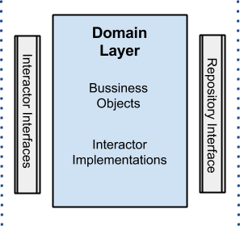

# CLean Architecture POC #

An example of clean architecture.

It has been created to show kotlin usage in real project and the advantages of decoupling from frameworks in the business rules. But also can be easily be integrated to Java if need be.

**Table of Contents**
* [Why Clean Architecture?](#why-clean-architecture)
* [Why Kotlin?](#why-kotlin)
* [Application structure](#application-structure)
* [Build and Running the Application](#build-and-running-the-application)

***
## Why Clean Architecture
> The center of your application is not the database. Nor is it one or more of the frameworks you may be using. **The center of your application is the use cases of your application**  -  _Unclebob_ ([source](https://blog.8thlight.com/uncle-bob/2012/05/15/NODB.html "NODB"))

Clean architecture helps us solve, or at least mitigate, these common problems with architecture:
* **Decisions are taken too early**, often at the beginning of a project, when we know the least about the problem that we have to solve
* **It's hard to change**, so when we discover new requirements we have to decide if we want to hack them in or go through an expensive and painful re-design. We all know which one usually wins. _The best architectures are the ones that allow us to defer commitment to a particular solution and let us change our mind_
* **It's centered around frameworks**. Frameworks are tools to be used, not architectures to be conformed to. Frameworks often require commitments from you, but they don’t commit to you. They can evolve in different directions, and then you’ll be stuck following their rules and quirks
* **It's centered around the database**. We often think about the database first, and then create a CRUD system around it. We end up using the database objects everywhere and treat everything in terms of tables, rows and columns
* **We focus on technical aspects** and when asked about our architecture we say things like “it’s servlets running in tomcat with an oracle db using spring”
* **It's hard to find things** which makes every change longer and more painful
* **Business logic is spread everywhere**, scattered across many layers, so when checking how something works our only option is to debug the whole codebase. Even worse, often it's duplicated in multiple places
* **Forces/Encourages slow, heavy tests**. Often our only choice for tests is to go through the GUI, either because the GUI has a lot of logic, or because the architecture doesn't allow us to do otherwise. This makes tests slow to run, heavy and brittle. It results in people not running them and the build beind broken often
* **Infrequent deploys** because it's hard to make changes without breaking existing functionalities. People resort to long-lived feature branches that only get integrated at the end and result in big releases, rather than small incremental ones

Clean architecture gives us all these benefits:
* **Effective testing strategy** that follows the [testing pyramid](http://martinfowler.com/bliki/TestPyramid.html) and gives us a fast and reliable build
* **Frameworks are isolated** in individual modules so that when (not if) we change our mind we only have to change one place, with the rest of the app not even knowing about it
* **Independent from Database**, which is treated just like any other data provider. Our app has real use cases rather than being a CRUD system
* **Screaming architecture** a.k.a. it screams its intended usage. When you look at the package structure you get a feel for what the application does rather than seeing technical details
* **All business logic is in a use case** so it's easy to find and it's not duplicated anywhere else
* **Hard to do the wrong thing** because modules enforce compilation dependencies. If you try to use something that you're not meant to, the app doesn't compile
* **We're always ready to deploy** by leaving the wiring up of the object for last or by using feature flags, so we get all the benefits of continuous integration (no need for feature branches)
* **Swarming on stories** so that different pairs can easily work on the same story at the same time to complete it quicker
* **Good monolith** with clear use cases that you can split in microservices later one, once you've learnt more about them

Of course, it comes at a cost:
* **Perceived duplication of code**. Entities might be represented differently when used in business logic, when dealing with the database and when presenting them in a json format. You might feel like you're duplicating cur_code, but you're actually favouring _decoupling over DRY_
* **You need interesting business logic** to "justify" the structure. If all you do in your use case is a one-line method to read or save from a database, then maybe you can get away with something simpler

***

## Why Kotlin

* **Java Interoperability** All your favourite java frameworks are available. And for any library written in kotlin can be used in java.
* **Named & default Arguments** This eliminates the need for builders.
```kotlin
fun build(title: String, width: Int = 800, height: Int = 600) {
    Frame(title, width, height)
}


build("PacMan", 400, 300)                           // equivalent
build(title = "PacMan", width = 400, height = 300)  // equivalent
build(width = 400, height = 300, title = "PacMan")  // equivalent
```
* **Data classes** It’s a POJO complete with toString(), equals(), hashCode(), and copy(), and unlike in Java it won’t take up 100 lines of code
```kotlin
data class Person(val name: String,
                  var email: String,
                  var age: Int)

val john = Person("John", "john@gmail.com", 112)
```
* **Operator Overloading** Improve readability using a set of operators available to be overloaded.
```kotlin
operator fun BigDecimal.div(other: BigDecimal): BigDecimal = this.divide(other, 10, BigDecimal.ROUND_HALF_EVEN)
operator fun BigDecimal.plus(other: BigDecimal) = this.add(other)

val one = 1.toBigDecimal()
val two = 2.toBigDecimal()
val three = 3.2.toBigDecimal()

println(one + two / three)
```
* **Extension Functions** Remember the first time you had to sort a ```List``` in Java? You couldn’t find a ```sort()```  function so you had to google to learn of ```Collections.sort()```. And later when you had to capitalize a String, you either end up writing your own helper function because you didn’t know of ```StringUtils.capitalize()```. Kotlin enables you to add new functions to old classes and with help of intellisence from ide.
```kotlin
fun String.replaceSpaces(): String {
    return this.replace(' ', '_')
}

val formatted = str.replaceSpaces()
``` 
 
 
 ## Application structure
 
 
 
 
 
 
 
 
 


## Build and Running the Application
```
./gradlew build && java -jar app/build/libs/app-0.0.1-SNAPSHOT.jar
```